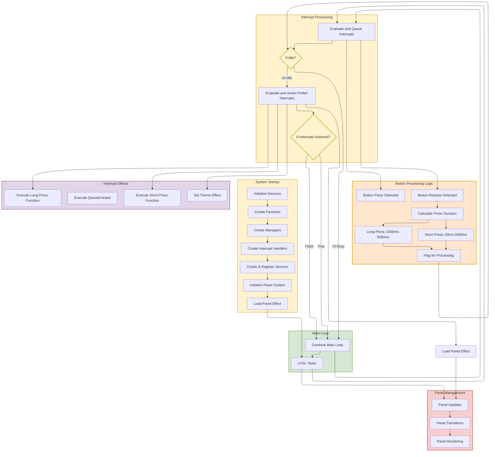

# Application Flow Diagram

This diagram illustrates the complete application flow from startup through runtime operations, showing the coordinated interrupt processing flow.

## Flow Overview

- **Startup Sequence**: Service initialization and coordinated handler creation
- **Main Loop Integration**: LVGL tasks, interrupt processing, and panel management work together
- **Interrupt Processing**: Continuous interrupt evaluation with idle-only execution phases
- **Panel Management**: Updates, transitions, and rendering integrated with main loop
- **Evaluation Model**: Queued interrupts evaluated continuously, polled interrupts evaluated only during idle
- **Execution Model**: All interrupt execution happens only during UI idle state
- **Coordinated Processing**: Priority-based interrupt coordination with centralized restoration
- **Hybrid Execution**: Single execution function per interrupt with centralized restoration logic
- **Panel Operations**: Lifecycle management and centralized restoration
- **Error Integration**: Critical priority error handling
- **Theme Switching**: Non-blocking theme changes

For detailed architecture, see: **[Architecture Document](../architecture.md)**

## Key Flow Details

### Startup Sequence
1. **Service Initialization**: Core services and system preparation
2. **Factory Creation**: ProviderFactory and ManagerFactory setup
3. **Handler Creation**: InterruptManager creates specialized handlers
4. **Sensor Creation**: Handlers create and own their sensors
5. **Interrupt Registration**: Static callbacks registered to handlers
6. **Panel System**: PanelManager ready for on-demand panel creation
7. **Initial Display**: Panel loads and main loop begins

### Runtime Processing
**Main Loop with Integrated Interrupt Processing**:

1. **Evaluate and Queue Interrupts**: 
   - Detect button press start/release events
   - Calculate press duration on release
   - Determine short (50ms-2000ms) vs long press (2000ms-5000ms)
   - Queue button events for processing
2. **Check UI Idle State**: 
   - **If UI NOT Idle**: Exit interrupt processing and continue main loop
   - **If UI IS Idle**: Continue to polled interrupt evaluation
3. **Evaluate and Action Polled Interrupts** (IDLE ONLY):
   - Check GPIO sensors (key, lock, lights, errors)
   - Execute polled interrupts (load panels, set themes)
4. **Check if Interrupts Actioned**: 
   - **If Interrupts Actioned**: Exit interrupt processing and continue main loop
   - **If No Interrupts Actioned**: Exit interrupt processing and continue main loop

**Key Architecture Benefits**:
- **Continuous Evaluation**: Button presses never missed regardless of UI state
- **Idle-Only Execution**: Protects UI performance during animations/rendering
- **Proper timing**: Accurate button press duration measurement
- **Clean separation**: Evaluation (always) vs execution (idle only)

### Interrupt Processing Steps
1. **State Change Detection**: Evaluation functions check current states
2. **Single Execution**: Execute function called once per state transition
3. **Priority Coordination**: Find highest priority active interrupt
4. **Centralized Restoration**: InterruptManager::HandleRestoration() manages all restoration decisions

### Centralized Restoration System
- **LOAD_PANEL Effects**: Participate in centralized restoration logic
- **SET_THEME Effects**: Never affect restoration decisions
- **SET_PREFERENCE Effects**: Immediate execution, no restoration impact
- **BUTTON_ACTION Effects**: Execute panel functions, no restoration impact
- **Restoration Decision**: InterruptManager queries all active panel-loading interrupts centrally

### Error System
- **Error Reporting**: Components report to ErrorManager
- **Critical Priority**: Error interrupts override other panels
- **User Interaction**: Error acknowledgment enables restoration

### Memory Safety
- **Static Callbacks**: Function pointers with void* context
- **Union-Based Data**: Memory-efficient effect data storage
- **Specialized Ownership**: Clear sensor ownership model
- **Change Detection**: BaseSensor template prevents corruption

### Performance Features
- **Change-Based Processing**: Functions execute only on state transitions
- **Priority Coordination**: Efficient highest-priority processing
- **Function Injection**: Memory-efficient panel function calls
- **Centralized Restoration**: Single restoration function eliminates distributed complexity
- **Memory Optimization**: Single execution function saves 28 bytes total
- **Idle Processing**: No overhead during LVGL operations

For complete architecture details, see: **[Architecture Document](../architecture.md)**