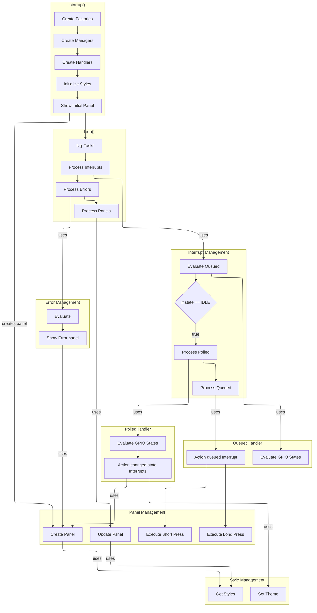

# Application Flow Diagram

This diagram illustrates the complete application flow from startup through runtime operations, showing the coordinated interrupt processing flow.

## Flow Overview

- **Startup Sequence**: Dual factory pattern initialization, handler creation with sensor ownership, and initial panel display
- **Main Loop Integration**: LVGL tasks, interrupt processing, error handling, and panel management work together
- **Handler Ownership**: PolledHandler creates/owns GPIO sensors, QueuedHandler creates/owns button sensor during initialization
- **Interrupt Processing**: Continuous queued interrupt evaluation with idle-only polled interrupt processing and execution
- **Panel Management**: Self-sufficient panels create own components, Key/Lock panels are display-only (no sensors)
- **Evaluation Model**: Queued interrupts evaluated continuously, polled interrupts evaluated and actioned only during idle
- **Execution Model**: All interrupt execution happens only during UI idle state, polled processed before queued
- **Single Execution Function**: Each interrupt has one execution function (no separate activate/deactivate)
- **Button Actions**: Short press and long press execution through interrupt handlers
- **Style Management**: Theme setting and style retrieval for panels
- **Error Integration**: Separate error evaluation and panel display flow
- **Theme Switching**: Non-blocking theme changes through polled interrupts

For detailed architecture, see: **[Architecture Document](../architecture.md)**

## Key Flow Details

### Startup Sequence
1. **Factory Creation**: 
   - ProviderFactory (implements IProviderFactory) creates hardware providers
   - ManagerFactory receives IProviderFactory for dependency injection
2. **Service Initialization**: ManagerFactory creates all managers (Interrupt, Panel, Style, Preference, Error)
3. **Handler Creation with Sensor Ownership**:
   - InterruptManager creates PolledHandler → owns GPIO sensors (Key, Lock, Lights)
   - InterruptManager creates QueuedHandler → owns ActionButtonSensor
4. **Initialize Styles**: Setup visual styles and themes for the UI
5. **Show Initial Panel**: 
   - PanelManager creates initial panel
   - Panel creates own components internally (self-sufficient design)
   - Key/Lock panels are display-only (no sensor creation)
6. **Enter Main Loop**: Begin LVGL tasks and runtime processing

### Runtime Processing
**Main Loop Flow (loop())**:

1. **LVGL Tasks**: Process LVGL rendering and animation tasks
2. **Process Interrupts**: Handle interrupt evaluation and execution
   - **Evaluate Queued Interrupts**: Continuously check button and queued events
   - **Check UI Idle State**: Determine if UI is idle for further processing
   - **If IDLE**: Process interrupts (polled before queued)
     - Evaluate and execute polled interrupts first (GPIO sensors → single execution function)
     - Then execute queued interrupts (button short/long press → single execution function)
     - Processing order ensures polled interrupts have priority over queued
3. **Process Errors**: Evaluate error conditions and show error panel if needed
4. **Process Panels**: Update current panel display and handle transitions

**Interrupt Processing Flow**:
- **Handler Ownership Model**:
  - PolledHandler owns all GPIO sensors (created during handler initialization)
  - QueuedHandler owns ActionButtonSensor (created during handler initialization)
- **Queued Interrupt Handler**: 
  - Evaluates queued interrupts continuously
  - Executes button presses via single execution function when idle
- **Polled Interrupt Handler**:
  - Evaluates GPIO-based interrupts only when idle
  - Executes via single execution function (no activate/deactivate split)
- **Processing Priority**: Polled interrupts execute before queued when both pending

**Key Architecture Benefits**:
- **Continuous Evaluation**: Queued interrupts always evaluated regardless of UI state
- **Idle-Only Execution**: Polled interrupts and all actions occur only during idle
- **Proper timing**: Accurate button press duration measurement
- **Clean separation**: Evaluation vs execution phases clearly defined

### Interrupt Processing Steps
1. **Evaluate Queued Interrupts**: Always check for button state changes (every loop)
2. **Check Idle State**: Determine if UI is idle before processing
3. **If Idle - Process Polled First**: 
   - Evaluate GPIO-based interrupts via handler-owned sensors
   - Execute via single execution function (no separate activate/deactivate)
4. **If Idle - Then Process Queued**: 
   - Execute button events via single execution function
   - Polled interrupts have already been processed (priority order)
5. **Execute Actions**: Single execution function per interrupt triggers effects

### Panel and Style Integration
- **Panel Self-Sufficiency**: 
  - Panels create their own components internally during initialization
  - Data panels (Oil) create own data sensors
  - Display-only panels (Key/Lock) create no sensors
- **Panel Creation**: PanelManager creates and loads panels on demand
- **Style Retrieval**: Panels get styles from StyleManager during creation and updates
- **Theme Changes**: StyleManager handles theme switching through SET_THEME effects
- **Button Actions**: Short and long press execute via single function pointer
- **Panel Updates**: Regular panel updates use current styles from StyleManager

### Error System
- **Error Evaluation**: Separate error evaluation in main loop
- **Error Panel Display**: Dedicated error panel shown when errors detected
- **Error Integration**: Process Errors step evaluates and shows error panel as needed

### Key System Components
- **Dual Factory Pattern**: 
  - ProviderFactory implements IProviderFactory for hardware abstraction
  - ManagerFactory uses dependency injection for testability
- **Interrupt Handlers with Ownership**: 
  - PolledHandler owns GPIO sensors (created during initialization)
  - QueuedHandler owns button sensor (created during initialization)
- **Panel Management**: Centralized panel creation, loading, and updates
- **Self-Sufficient Panels**: Create own components, Key/Lock are display-only
- **Style Management**: Theme setting and style retrieval for consistent UI
- **Single Execution Model**: One execution function per interrupt (simplified design)

### Performance Features
- **Processing Order**: Polled interrupts execute before queued when both pending
- **Idle-Based Processing**: Polled interrupts and all execution only during UI idle
- **Continuous Evaluation**: Queued interrupts always evaluated for responsiveness
- **Efficient Flow**: Main loop integrates LVGL, interrupts, errors, and panels
- **Clean Architecture**: Clear separation between evaluation and execution phases
- **Memory Optimized**: Single execution function reduces memory overhead (ESP32 320KB RAM constraint)

For complete architecture details, see: **[Architecture Document](../architecture.md)**