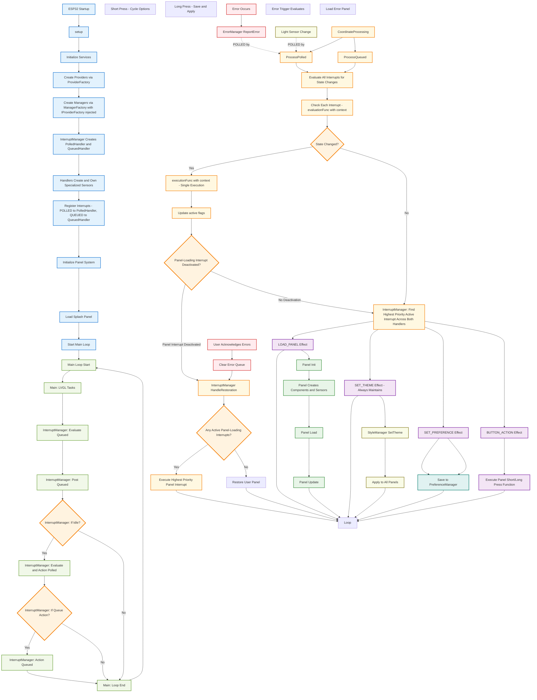

# Application Flow Diagram

This diagram illustrates the complete application flow from startup through runtime operations, showing the coordinated interrupt processing flow.

## Flow Overview

- **Startup Sequence**: Service initialization and coordinated handler creation
- **Main Loop**: LVGL tasks with separate interrupt evaluation and execution phases
- **Evaluation Model**: Queued interrupts evaluated every loop, polled interrupts evaluated only during idle
- **Execution Model**: All interrupt execution happens only during UI idle state
- **Coordinated Processing**: Priority-based interrupt coordination with centralized restoration
- **Hybrid Execution**: Single execution function per interrupt with centralized restoration logic
- **Panel Operations**: Lifecycle management and centralized restoration
- **Error Integration**: Critical priority error handling
- **Theme Switching**: Non-blocking theme changes

For detailed architecture, see: **[Architecture Document](../architecture.md)**

## Key Flow Details

### Startup Sequence
1. **Service Initialization**: Core services and system preparation
2. **Factory Creation**: ProviderFactory and ManagerFactory setup
3. **Handler Creation**: InterruptManager creates specialized handlers
4. **Sensor Creation**: Handlers create and own their sensors
5. **Interrupt Registration**: Static callbacks registered to handlers
6. **Panel System**: PanelManager ready for on-demand panel creation
7. **Initial Display**: Splash panel loads with animation

### Runtime Processing
**Exact Main Loop Flow Sequence**:

1. **Main Loop Start**: Begin new loop iteration
2. **Main: LVGL Tasks**: Process UI updates and rendering
3. **InterruptManager: Evaluate Queued**: Always check button state changes 
4. **InterruptManager: Post Queued**: Queue button events if state changed
5. **InterruptManager: If Idle**: Check if UI is in idle state
   - **If UI NOT Idle**: Skip to step 8 (Loop End)
   - **If UI IS Idle**: Continue to step 6
6. **InterruptManager: Evaluate and Action Polled**: Check GPIO sensors and execute polled interrupts
7. **InterruptManager: If Queue Action**: Check if queued interrupt needs execution
   - **If Queue Action Needed**: Execute queued interrupt
   - **If No Queue Action**: Skip queued execution  
8. **Main: Loop End**: Complete loop iteration, return to step 1

### Interrupt Processing Steps
1. **State Change Detection**: Evaluation functions check current states
2. **Single Execution**: Execute function called once per state transition
3. **Priority Coordination**: Find highest priority active interrupt
4. **Centralized Restoration**: InterruptManager::HandleRestoration() manages all restoration decisions

### Centralized Restoration System
- **LOAD_PANEL Effects**: Participate in centralized restoration logic
- **SET_THEME Effects**: Never affect restoration decisions
- **SET_PREFERENCE Effects**: Immediate execution, no restoration impact
- **BUTTON_ACTION Effects**: Execute panel functions, no restoration impact
- **Restoration Decision**: InterruptManager queries all active panel-loading interrupts centrally

### Error System
- **Error Reporting**: Components report to ErrorManager
- **Critical Priority**: Error interrupts override other panels
- **User Interaction**: Error acknowledgment enables restoration

### Memory Safety
- **Static Callbacks**: Function pointers with void* context
- **Union-Based Data**: Memory-efficient effect data storage
- **Specialized Ownership**: Clear sensor ownership model
- **Change Detection**: BaseSensor template prevents corruption

### Performance Features
- **Change-Based Processing**: Functions execute only on state transitions
- **Priority Coordination**: Efficient highest-priority processing
- **Function Injection**: Memory-efficient panel function calls
- **Centralized Restoration**: Single restoration function eliminates distributed complexity
- **Memory Optimization**: Single execution function saves 28 bytes total
- **Idle Processing**: No overhead during LVGL operations

For complete architecture details, see: **[Architecture Document](../architecture.md)**