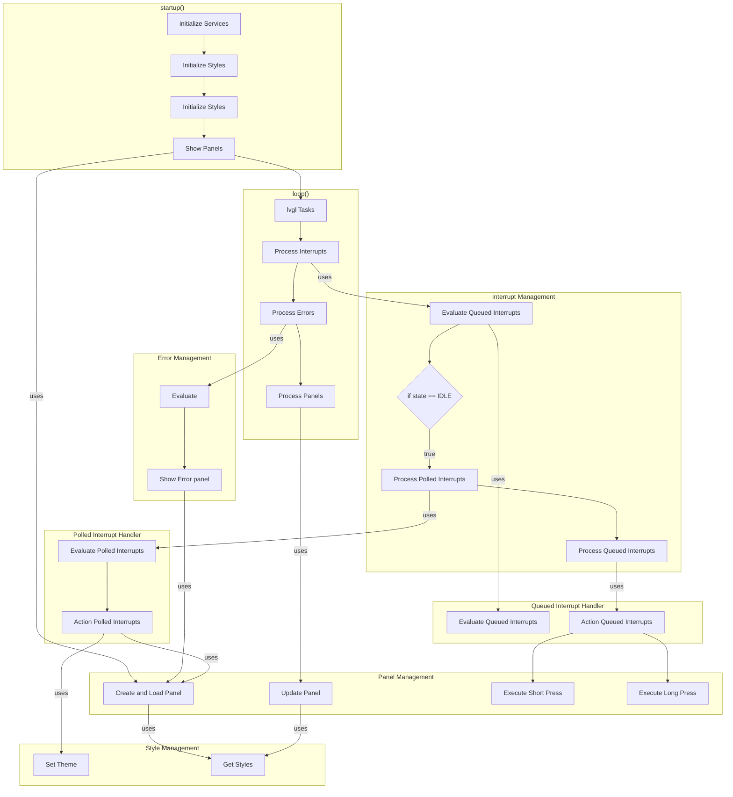

# Application Flow Diagram

This diagram illustrates the complete application flow from startup through runtime operations, showing the coordinated interrupt processing flow.

## Flow Overview

- **Startup Sequence**: Service initialization, styles setup, and initial panel display
- **Main Loop Integration**: LVGL tasks, interrupt processing, error handling, and panel management work together
- **Interrupt Processing**: Continuous queued interrupt evaluation with idle-only polled interrupt processing and execution
- **Panel Management**: Create/load panels, updates, and button action execution integrated with main loop
- **Evaluation Model**: Queued interrupts evaluated continuously, polled interrupts evaluated and actioned only during idle
- **Execution Model**: All interrupt execution happens only during UI idle state
- **Button Actions**: Short press and long press execution through interrupt handlers
- **Style Management**: Theme setting and style retrieval for panels
- **Error Integration**: Separate error evaluation and panel display flow
- **Theme Switching**: Non-blocking theme changes through polled interrupts

For detailed architecture, see: **[Architecture Document](../architecture.md)**

## Key Flow Details

### Startup Sequence
1. **Service Initialization**: Core services and system preparation
2. **Factory Creation**: ProviderFactory and ManagerFactory setup with dependency injection
3. **Initialize Styles**: Setup visual styles and themes for the UI
4. **Handler Creation**: InterruptManager creates PolledHandler and QueuedHandler
5. **Sensor Creation**: Handlers create and own their respective sensors
6. **Show Panels**: PanelManager creates and loads initial panel display
7. **Enter Main Loop**: Begin LVGL tasks and runtime processing

### Runtime Processing
**Main Loop Flow (loop())**:

1. **LVGL Tasks**: Process LVGL rendering and animation tasks
2. **Process Interrupts**: Handle interrupt evaluation and execution
   - **Evaluate Queued Interrupts**: Continuously check button and queued events
   - **Check UI Idle State**: Determine if UI is idle for further processing
   - **If IDLE**: Process both polled and queued interrupts
     - Evaluate polled interrupts (GPIO sensors)
     - Action polled interrupts (theme changes, panel loads)
     - Action queued interrupts (button short/long press)
3. **Process Errors**: Evaluate error conditions and show error panel if needed
4. **Process Panels**: Update current panel display and handle transitions

**Interrupt Processing Flow**:
- **Queued Interrupt Handler**: 
  - Evaluates queued interrupts continuously
  - Actions button presses (short and long) when idle
- **Polled Interrupt Handler**:
  - Evaluates GPIO-based interrupts only when idle
  - Actions panel loads and theme changes

**Key Architecture Benefits**:
- **Continuous Evaluation**: Queued interrupts always evaluated regardless of UI state
- **Idle-Only Execution**: Polled interrupts and all actions occur only during idle
- **Proper timing**: Accurate button press duration measurement
- **Clean separation**: Evaluation vs execution phases clearly defined

### Interrupt Processing Steps
1. **Evaluate Interrupts**: Check for state changes in queued and polled interrupts
2. **Check Idle State**: Determine if UI is idle before processing
3. **Process Polled Interrupts**: Evaluate and action GPIO-based interrupts (idle only)
4. **Process Queued Interrupts**: Action button events and other queued interrupts (idle only)
5. **Execute Actions**: Trigger appropriate effects (panel loads, theme changes, button actions)

### Panel and Style Integration
- **Panel Creation**: PanelManager creates and loads panels on demand
- **Style Retrieval**: Panels get styles from StyleManager during creation and updates
- **Theme Changes**: StyleManager handles theme switching through SET_THEME effects
- **Button Actions**: Short and long press actions execute panel-specific functions
- **Panel Updates**: Regular panel updates use current styles from StyleManager

### Error System
- **Error Evaluation**: Separate error evaluation in main loop
- **Error Panel Display**: Dedicated error panel shown when errors detected
- **Error Integration**: Process Errors step evaluates and shows error panel as needed

### Key System Components
- **Interrupt Handlers**: Separate handlers for queued and polled interrupts
- **Panel Management**: Centralized panel creation, loading, and updates
- **Style Management**: Theme setting and style retrieval for consistent UI
- **Button Processing**: Short and long press detection with action execution

### Performance Features
- **Idle-Based Processing**: Polled interrupts and actions only during UI idle
- **Continuous Evaluation**: Queued interrupts always evaluated for responsiveness
- **Efficient Flow**: Main loop integrates LVGL, interrupts, errors, and panels
- **Clean Architecture**: Clear separation between evaluation and action phases

For complete architecture details, see: **[Architecture Document](../architecture.md)**