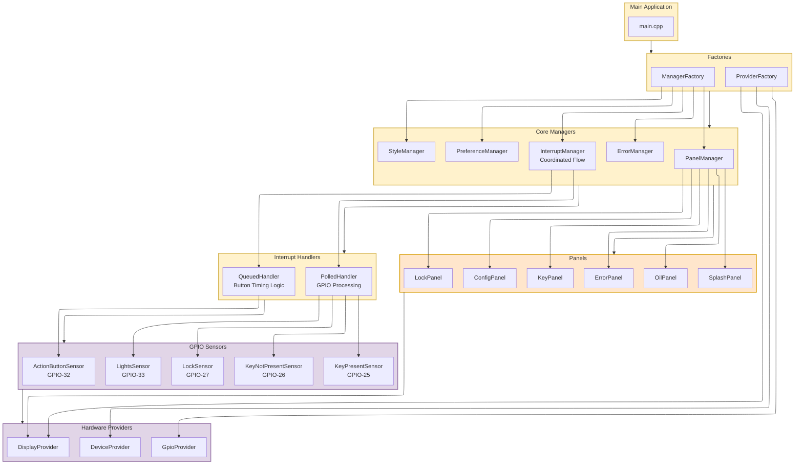

# Architecture Overview Diagram

This diagram shows the high-level component relationships in the Clarity system with the implemented interrupt flow and button timing differentiation.

## Key Architectural Elements

- **Interrupt Flow**: InterruptManager implements precise main loop flow with evaluation/execution separation
- **Button Timing Logic**: Built-in short press (50ms-2000ms) and long press (2000ms-5000ms) differentiation
- **Always vs Idle Processing**: Queued evaluation always runs, polled evaluation only during UI idle
- **Dual Factory Pattern**: ProviderFactory creates providers, ManagerFactory creates managers with dependency injection
- **Interface-Based Factories**: IProviderFactory enables testability with mock provider injection
- **Handler-Owned Sensors**: Handlers create and own their respective sensors internally
- **Panel Self-Sufficiency**: Panels create their own components and data sensors internally
- **Split Sensor Design**: Independent KeyPresentSensor and KeyNotPresentSensor classes
- **Static Callbacks**: InterruptCallbacks utility with single execution function per interrupt
- **Centralized Restoration**: InterruptManager::HandleRestoration() manages all panel restoration decisions
- **Display-Only GPIO Panels**: Key/Lock panels don't create sensors, only display state
- **Hardware Abstraction**: Providers isolate hardware dependencies

## Component Responsibilities

### Factories
- **ProviderFactory**: Implements IProviderFactory interface, creates all hardware providers (GpioProvider, DisplayProvider, DeviceProvider)
- **ManagerFactory**: Creates all managers, receives IProviderFactory for dependency injection

### Managers
- **InterruptManager**: Implements interrupt flow with evaluation/execution separation, manages button press timing (50ms-2000ms short, 2000ms-5000ms long), coordinates PolledHandler and QueuedHandler with centralized restoration logic
- **PanelManager**: Creates panels on demand, manages lifecycle, switching, and restoration tracking
- **StyleManager**: Theme management (Day/Night) based on LightsSensor
- **PreferenceManager**: Persistent settings storage
- **ErrorManager**: Error collection with coordinated interrupt system integration

### Coordinated Handlers (IHandler Interface)
- **PolledHandler**: Creates and owns GPIO sensors for state monitoring, processes POLLED interrupts during UI IDLE time only, manages GPIO state changes and panel loading effects
- **QueuedHandler**: Creates and owns button sensor, provides button state to InterruptManager for timing logic, executes queued button actions during UI IDLE time only
- **Centralized Processing**: InterruptManager handles button press detection and timing logic directly, handlers focus on their specialized interrupt types

### Sensors (ISensor + BaseSensor)
- **GPIO Interrupt Sensors**: Created and owned by PolledHandler for GPIO state monitoring (Key, Lock, Lights sensors)
- **Button State Sensor**: Created and owned by QueuedHandler, provides GPIO state only - timing logic handled by InterruptManager
- **Data Sensors**: Created by data panels for continuous measurement (Oil pressure, temperature)
- **BaseSensor**: Provides change detection template for all sensors

### Panels (IPanel Interface)
- **Display-Only Panels**: Display-only, create own components but no sensors (Key, Lock)
- **Data Panels**: Create own sensors and components for data acquisition (Oil)
- **Utility Panels**: Create own components for system functions (Splash, Error, Config)

### Critical Architecture Constraints
- **Interrupt Flow**: Precise main loop sequence with evaluation/execution separation for optimal UI performance
- **Button Timing Integration**: Built-in press duration measurement (50ms-2000ms short, 2000ms-5000ms long) in InterruptManager
- **Always vs Idle Processing**: Queued interrupt evaluation (button detection) runs every loop, polled evaluation only during UI idle
- **Interface-Based Design**: All major components implement interfaces for testability and loose coupling
- **Dual Factory Pattern**: Separate factories for providers (ProviderFactory) and managers (ManagerFactory)
- **Dependency Injection**: IProviderFactory interface enables test mocking and clean separation
- **Generic Factory Support**: Template-based IFactory<T> for type-safe component creation
- **Centralized Restoration**: InterruptManager::HandleRestoration() eliminates distributed restoration complexity
- **Effect-Based Execution**: Interrupts categorized by effect (LOAD_PANEL, SET_THEME, BUTTON_ACTION) for simplified logic
- **Specialized Ownership**: PolledHandler owns GPIO sensors, QueuedHandler owns button sensor
- **Memory Safety**: Designed for ESP32 320KB RAM constraint with optimized data structures
- **Change Detection**: POLLED interrupts fire on state transitions only, button timing handled by InterruptManager