# Interrupt Handling Flow Diagram

This diagram illustrates the detailed interrupt processing flow in the v4.0 Trigger/Action architecture, showing the distinct processing paths for state-based Triggers and event-based Actions.

## Flow Overview

- **Dual Processing Model**: Separate evaluation and execution phases for Triggers vs Actions
- **Continuous Action Evaluation**: ActionHandler evaluates every main loop iteration for responsiveness
- **Idle-Only Trigger Processing**: TriggerHandler evaluates and executes only during UI IDLE state
- **Priority Override System**: Triggers implement sophisticated blocking logic with canBeOverriddenOnActivate flag
- **Queue-Based Actions**: Actions queue events immediately, execute during idle in registration order
- **State Change Detection**: Triggers fire only on GPIO state transitions using BaseSensor change detection
- **Memory Optimized**: Direct singleton calls eliminate context parameters (~96 bytes total system overhead)
- **Handler Ownership**: TriggerHandler owns GPIO sensors, ActionHandler owns ActionButtonSensor

For complete architecture details, see: **[Architecture Document](../architecture.md)**

```mermaid
---
config:
  layout: elk
  theme: default
  elk: {}
---
flowchart TD
    subgraph MainLoop["Main Loop (every iteration)"]
        Start([Loop Start])
        LVGL[LVGL Tasks]
        InterruptMgr[InterruptManager Process]
        ErrorMgr[Error Manager Process]
        PanelMgr[Panel Manager Update]
        LoopEnd([Loop End])
    end
    
    subgraph InterruptProcessing["Interrupt Processing"]
        ActionEval[Action Evaluation<br/>ALWAYS]
        IdleCheck{UI State<br/>== IDLE?}
        TriggerProc[Trigger Processing<br/>IDLE ONLY]
        ActionExec[Action Execution<br/>IDLE ONLY]
    end
    
    subgraph ActionHandling["Action Handler Flow"]
        ActionSensor[ActionButtonSensor<br/>Check State]
        ActionChanged{State<br/>Changed?}
        TimingCheck[Check Press Duration]
        ShortPress{50ms-2000ms<br/>SHORT?}
        LongPress{2000ms-5000ms<br/>LONG?}
        QueueShort[Queue Short Action<br/>hasTriggered = true]
        QueueLong[Queue Long Action<br/>hasTriggered = true]
        ActionReturn[Return to Main]
    end
    
    subgraph ActionExecution["Action Execution (Idle Only)"]
        ActionPending{Actions<br/>Queued?}
        ExecuteAction[Execute Action Function<br/>Clear hasTriggered]
        ActionComplete[Action Complete]
    end
    
    subgraph TriggerHandling["Trigger Handler Flow"]
        TriggerLoop[For Each Trigger]
        SensorCheck[Check Sensor<br/>HasStateChanged]
        TriggerChanged{State<br/>Changed?}
        StateDirection{HIGH or<br/>LOW?}
        ActivateFlow[Activation Flow]
        DeactivateFlow[Deactivation Flow]
        TriggerComplete[Trigger Complete]
    end
    
    subgraph ActivationFlow["Trigger Activation Flow"]
        OverrideCheck{canBeOverridden<br/>== true?}
        FindBlocking[Find Higher Priority<br/>Active Triggers]
        BlockingFound{Blocking<br/>Found?}
        ReExecuteBlocking[Re-execute Blocking<br/>Trigger activateFunc]
        ExecuteActivate[Execute New Trigger<br/>activateFunc<br/>isActive = true]
        ActivateComplete[Activation Complete]
    end
    
    subgraph DeactivationFlow["Trigger Deactivation Flow"]
        ExecuteDeactivate[Execute Trigger<br/>deactivateFunc<br/>isActive = false]
        DeactivateComplete[Deactivation Complete]
    end
    
    subgraph StateDetection["State Change Detection"]
        BaseSensor[BaseSensor<br/>DetectChange Template]
        PrevState[Previous State<br/>Tracking]
        CurrentState[Current GPIO<br/>Reading]
        StateComparison[Compare Current<br/>vs Previous]
        UpdatePrevious[Update Previous<br/>State]
    end
    
    %% Main Loop Flow
    Start --> LVGL
    LVGL --> InterruptMgr
    InterruptMgr --> ErrorMgr
    ErrorMgr --> PanelMgr
    PanelMgr --> LoopEnd
    LoopEnd --> Start
    
    %% Interrupt Manager Flow
    InterruptMgr --> ActionEval
    ActionEval --> IdleCheck
    IdleCheck -->|Yes| TriggerProc
    IdleCheck -->|No| ErrorMgr
    TriggerProc --> ActionExec
    ActionExec --> ErrorMgr
    
    %% Action Evaluation Flow
    ActionEval --> ActionSensor
    ActionSensor --> ActionChanged
    ActionChanged -->|Yes| TimingCheck
    ActionChanged -->|No| IdleCheck
    TimingCheck --> ShortPress
    ShortPress -->|Yes| QueueShort
    ShortPress -->|No| LongPress
    LongPress -->|Yes| QueueLong
    LongPress -->|No| ActionReturn
    QueueShort --> IdleCheck
    QueueLong --> IdleCheck
    ActionReturn --> IdleCheck
    
    %% Action Execution Flow  
    ActionExec --> ActionPending
    ActionPending -->|Yes| ExecuteAction
    ActionPending -->|No| ErrorMgr
    ExecuteAction --> ActionComplete
    ActionComplete --> ErrorMgr
    
    %% Trigger Processing Flow
    TriggerProc --> TriggerLoop
    TriggerLoop --> SensorCheck
    SensorCheck --> TriggerChanged
    TriggerChanged -->|Yes| StateDirection
    TriggerChanged -->|No| TriggerComplete
    StateDirection -->|HIGH| ActivateFlow
    StateDirection -->|LOW| DeactivateFlow
    TriggerComplete --> ActionExec
    
    %% Activation Flow
    ActivateFlow --> OverrideCheck
    OverrideCheck -->|No| ExecuteActivate
    OverrideCheck -->|Yes| FindBlocking
    FindBlocking --> BlockingFound
    BlockingFound -->|Yes| ReExecuteBlocking
    BlockingFound -->|No| ExecuteActivate
    ReExecuteBlocking --> ActivateComplete
    ExecuteActivate --> ActivateComplete
    ActivateComplete --> TriggerComplete
    
    %% Deactivation Flow
    DeactivateFlow --> ExecuteDeactivate
    ExecuteDeactivate --> DeactivateComplete
    DeactivateComplete --> TriggerComplete
    
    %% State Detection Integration
    SensorCheck --> BaseSensor
    BaseSensor --> PrevState
    BaseSensor --> CurrentState
    CurrentState --> StateComparison
    PrevState --> StateComparison
    StateComparison --> UpdatePrevious
    UpdatePrevious --> TriggerChanged
    
    %% Styling
    classDef mainloop fill:#d5e8d4,stroke:#82b366,stroke-width:2px
    classDef interrupt fill:#fff2cc,stroke:#d6b656,stroke-width:2px
    classDef action fill:#e1d5e7,stroke:#9673a6,stroke-width:2px
    classDef trigger fill:#f8cecc,stroke:#b85450,stroke-width:2px
    classDef decision fill:#fff2cc,stroke:#d6b656,stroke-width:3px
    classDef process fill:#dae8fc,stroke:#6c8ebf,stroke-width:2px
    classDef sensor fill:#ffe6cc,stroke:#d79b00,stroke-width:2px
    
    class Start,LVGL,ErrorMgr,PanelMgr,LoopEnd mainloop
    class InterruptMgr,ActionEval,InterruptProcessing interrupt
    class ActionSensor,TimingCheck,QueueShort,QueueLong,ExecuteAction,ActionHandling,ActionExecution action
    class TriggerLoop,SensorCheck,ActivateFlow,DeactivateFlow,ExecuteActivate,ExecuteDeactivate,TriggerHandling,ActivationFlow,DeactivationFlow trigger
    class IdleCheck,ActionChanged,ShortPress,LongPress,TriggerChanged,StateDirection,OverrideCheck,BlockingFound,ActionPending decision
    class ReExecuteBlocking,ActionComplete,TriggerComplete,ActivateComplete,DeactivateComplete process
    class BaseSensor,PrevState,CurrentState,StateComparison,UpdatePrevious,StateDetection sensor
    
    style MainLoop fill:#E8F5E8
    style InterruptProcessing fill:#FFF8DC
    style ActionHandling fill:#F0E6FF
    style ActionExecution fill:#F0E6FF
    style TriggerHandling fill:#FFE6E6
    style ActivationFlow fill:#FFE6E6
    style DeactivationFlow fill:#FFE6E6
    style StateDetection fill:#FFF0E6
```



## Key Flow Details

### Main Loop Integration

**Continuous Processing Model**:
1. **LVGL Tasks**: Process UI rendering and animations
2. **InterruptManager Process**: Coordinate interrupt evaluation and execution
3. **Error Manager Process**: Handle system error conditions
4. **Panel Manager Update**: Update current panel display
5. **Loop Iteration**: Return to start for next cycle

### Interrupt Processing Coordination

**InterruptManager Orchestration**:
- **Action Evaluation**: Always performed every main loop iteration
- **Idle State Check**: Determines if UI is idle for further processing
- **Trigger Processing**: Only performed during UI IDLE state
- **Action Execution**: Only performed during UI IDLE state after Triggers
- **Processing Order**: Triggers execute before Actions when both pending

### Action Handler Flow (Event-Based)

**Continuous Evaluation Model**:
1. **Sensor Check**: ActionButtonSensor checks GPIO state every iteration
2. **Change Detection**: Uses BaseSensor change detection template
3. **Timing Analysis**: Measure press duration for event classification
4. **Event Queuing**: Set `hasTriggered = true` for valid events
5. **Idle Execution**: Process all queued Actions during UI idle

**Press Duration Classification**:
- **Short Press**: 50ms - 2000ms duration
- **Long Press**: 2000ms - 5000ms duration  
- **Invalid Press**: Outside duration ranges (ignored)

**Queue Management**:
- **Registration Order**: Actions execute in registration order (no priority)
- **Event Flags**: Each Action maintains `hasTriggered` boolean
- **Queue Clearing**: Set `hasTriggered = false` after execution

### Trigger Handler Flow (State-Based)

**Idle-Only Processing Model**:
1. **Idle Check**: TriggerHandler only processes during UI IDLE state
2. **Sensor Iteration**: Check each registered Trigger's sensor
3. **State Change Detection**: Use BaseSensor template for change detection
4. **Direction Analysis**: Determine HIGH (activate) vs LOW (deactivate) transition
5. **Function Execution**: Execute appropriate activate/deactivate function

**Activation Flow with Override Logic**:
1. **Override Check**: Examine `canBeOverriddenOnActivate` flag
2. **Blocking Search**: Find higher-priority active non-overridable Triggers
3. **Resolution Decision**:
   - **Blocking Found**: Re-execute blocking Trigger's `activateFunc()`
   - **No Blocking**: Execute new Trigger's `activateFunc()`, set `isActive = true`

**Deactivation Flow**:
1. **Direct Execution**: Execute Trigger's `deactivateFunc()`
2. **State Update**: Set `isActive = false`
3. **No Override Logic**: Deactivation cannot be blocked

### State Change Detection System

**BaseSensor Template Pattern**:
- **Previous State Storage**: Each sensor maintains previous GPIO state
- **Current State Reading**: Direct GPIO read via hardware provider
- **Change Comparison**: Template-based comparison (current != previous)
- **State Update**: Update previous state after change detection
- **Initialization Handling**: No change detected on first read

**Sensor Requirements**:
```cpp
class GPIOSensor : public BaseSensor {
private:
    bool previousState_ = false;  // Required for change detection
    
public:
    bool HasStateChanged() {
        bool currentState = digitalRead(gpio_);
        return DetectChange(currentState, previousState_);  // BaseSensor template
    }
};
```

## Processing Model Comparison

### Timing Differences

| Phase | Actions (Event-Based) | Triggers (State-Based) |
|-------|----------------------|------------------------|
| **Evaluation** | Every main loop iteration | Only during UI IDLE |
| **Execution** | Only during UI IDLE | Only during UI IDLE |
| **Responsiveness** | High (continuous evaluation) | Standard (idle evaluation) |

### Processing Characteristics

| Aspect | Actions | Triggers |
|--------|---------|----------|
| **Change Detection** | Press duration events | GPIO state transitions |
| **State Persistence** | No previous state needed | Requires previous state tracking |
| **Queue Mechanism** | Event queuing with flags | Direct state-based execution |
| **Priority System** | None (registration order) | CRITICAL > IMPORTANT > NORMAL |
| **Override Logic** | None (all queued Actions execute) | canBeOverriddenOnActivate flag |
| **Function Count** | Single execute function | Dual activate/deactivate functions |

## Architecture Benefits

### Performance Optimizations
- **Continuous Responsiveness**: Actions always evaluated for immediate event detection
- **Idle Protection**: Both execution types respect UI idle state for LVGL compatibility
- **Processing Priority**: Triggers process before Actions when both pending
- **Memory Efficiency**: Static structures with direct singleton calls (~96 bytes total)

### Reliability Features
- **State Consistency**: BaseSensor change detection prevents false triggers
- **Override Protection**: Non-overridable Triggers cannot be blocked by lower priority
- **Queue Integrity**: Action events preserved until idle execution opportunity
- **Error Isolation**: Failed interrupt execution doesn't affect other interrupts

### Architectural Clarity
- **Separation of Concerns**: State-based vs event-based interrupt models
- **Predictable Behavior**: Clear evaluation and execution timing rules
- **Maintainable Code**: Interface-based design with clear responsibilities
- **Testable Components**: Individual handler testing with mock sensors

For complete implementation details, see: **[Architecture Document](../architecture.md)**