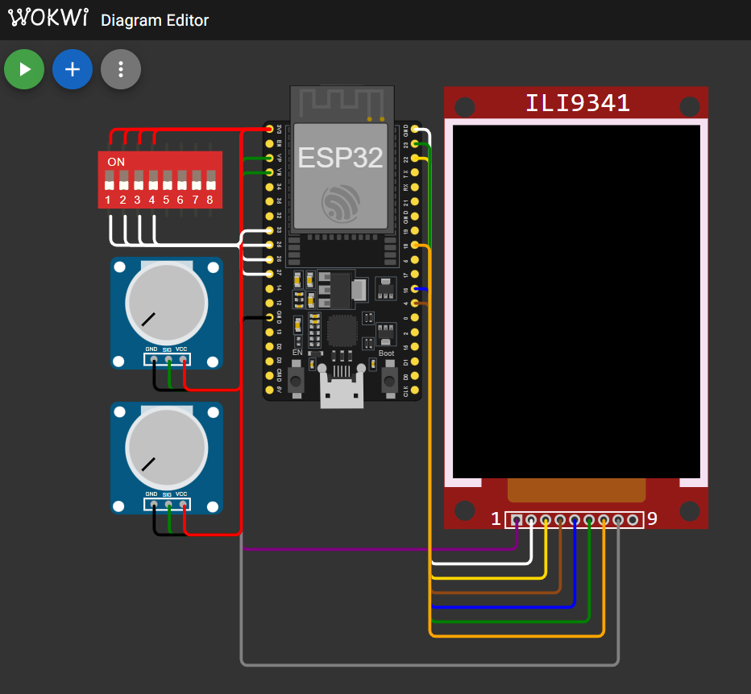

# Hardware Documentation

## Overview

Clarity is designed for ESP32-based automotive gauge systems with a round display. This document details the intended hardware configuration and the Wokwi emulator setup used for development and testing.

## Target Hardware

### Microcontroller
- **Board**: NodeMCU-32S Development Board
- **Chip**: ESP32-WROOM-32 (4MB Flash)
- **Architecture**: Dual-core Tensilica Xtensa LX6
- **Clock Speed**: 240MHz
- **RAM**: 320KB total (250KB available after system overhead and OTA partitioning)

### Display
- **Model**: Waveshare Round 1.28" LCD Display Module
- **Controller**: GC9A01 
- **Resolution**: 240x240 pixels
- **Shape**: Round display
- **Interface**: SPI
- **Colors**: 65K colors (RGB565)

### Display Connections (SPI)
| Function | ESP32 Pin | Wire Color |
|----------|-----------|------------|
| SCK      | GPIO 18   | Orange     |
| MOSI     | GPIO 23   | Green      |
| MISO     | -1 (NC)   | -          |
| DC       | GPIO 16   | Blue       |
| CS       | GPIO 22   | Gold       |
| RST      | GPIO 4    | Brown      |
| BL       | GPIO 3    | Gray       |
| VCC      | 3.3V      | Purple     |
| GND      | GND       | White      |

## Sensor Inputs

### Analog Sensors (ADC)
| Sensor           | ESP32 Pin | ADC Channel | Range    | Purpose              |
|------------------|-----------|-------------|----------|----------------------|
| Oil Pressure     | GPIO 36   | VP (ADC1_0) | 0-4095   | Engine oil pressure  |
| Oil Temperature  | GPIO 39   | VN (ADC1_3) | 0-4095   | Engine oil temperature |

### Digital Sensors (GPIO)
| Sensor           | ESP32 Pin | Mode        | Pull Config | Purpose                    |
|------------------|-----------|-------------|-------------|----------------------------|
| Key Present      | GPIO 25   | INPUT       | PULLDOWN    | Ignition key detected      |
| Key Not Present  | GPIO 26   | INPUT       | PULLDOWN    | Ignition key not detected  |
| Lock State       | GPIO 27   | INPUT       | PULLDOWN    | Vehicle lock status        |
| Light Sensor     | GPIO 33   | INPUT       | PULLDOWN    | Day/night detection        |
| Input Button     | GPIO 32   | INPUT       | PULLDOWN    | Single button navigation   |
| Debug Error Sensor | GPIO 34 | INPUT       | None*       | Debug error trigger (dev only) |

*GPIO 34 is an input-only pin without internal pull resistors. External pull-down required for stable operation.
**Development Only**: Debug error sensor is only active in CLARITY_DEBUG builds for system testing.

## Power Configuration
- **Supply Voltage**: 3.3V (regulated from 12V automotive supply)
- **Display Current**: ~40mA (typical)
- **ESP32 Current**: ~80mA (active), ~10µA (deep sleep)
- **Total System**: ~120mA (operational)

## Wokwi Emulator Configuration

For development and testing, Clarity uses the Wokwi online ESP32 simulator.  


### Emulator Hardware Setup
- **Board**: ESP32 DevKit C v4 (closest available to NodeMCU-32S)
- **Display**: ILI9341 240x320 (emulates GC9A01 functionality because wokwi does not have a round display)
- **Controls**: DIP switch (8-position) for digital inputs
- **Analog Inputs**: 2x Potentiometers for oil sensors

### Wokwi Component Mapping
| Real Hardware        | Wokwi Component    | Connection        | Purpose                |
|---------------------|-------------------|-------------------|------------------------|
| GC9A01 Round Display| ILI9341 LCD       | SPI Bus          | Display emulation      |
| Oil Pressure Sensor | Potentiometer 1   | ESP32:VP (GPIO36)| Pressure simulation    |
| Oil Temperature Sensor| Potentiometer 2 | ESP32:VN (GPIO39)| Temperature simulation |
| Key Present Switch  | DIP Switch #1     | ESP32:GPIO25     | Key detection          |
| Key Not Present Switch| DIP Switch #2   | ESP32:GPIO26     | Key absence detection  |
| Lock Switch         | DIP Switch #3     | ESP32:GPIO27     | Lock state             |
| Light Sensor        | DIP Switch #4     | ESP32:GPIO33     | Day/night simulation   |
| Input Button        | Push Button       | ESP32:GPIO32     | User input             |
| Debug Error Sensor  | DIP Switch #8     | ESP32:GPIO34     | Error trigger (debug)  |

### Wokwi Limitations
- **Display Shape**: Uses square ILI9341 instead of round GC9A01
- **Image Inversion**: Wokwi renders images horizontally inverted
- **Resolution**: 240x320 vs target 240x240 (only top portion used)
- **Hardware Acceleration**: No native SPI DMA emulation

### Wokwi Diagram Configuration
```json
{
  "version": 1,
  "author": "Marcel Rienks",
  "editor": "wokwi",
  "parts": [
    { "type": "board-esp32-devkit-c-v4", "id": "esp" },
    { "type": "wokwi-ili9341", "id": "lcd1" },
    { "type": "wokwi-potentiometer", "id": "pot1" },
    { "type": "wokwi-potentiometer", "id": "pot2" },
    { "type": "wokwi-dip-switch-8", "id": "sw1" },
    { "type": "wokwi-pushbutton", "id": "btn1" }
  ]
}
```

## Build Configurations

### Hardware-Specific Builds
- **debug-local**: Fast compilation for local testing (no display inversion)
- **debug-upload**: Hardware upload build with display inversion for Waveshare
- **release**: Optimized production build with display inversion

### Conditional Compilation
```cpp
#ifdef WOKWI_EMULATOR
    // Enable horizontal mirroring for wokwi emulator limitation
    writeCommand(0x36);
    writeData(0x48);    // MX bit (0x40) + BGR bit (0x08)
#endif

#ifdef INVERT
    cfg.invert = true;  // For waveshare displays
#endif
```

## Testing Approach

### Unit Testing
- Native execution on development machine
- Mock all hardware interfaces
- Test core logic without physical hardware

### Integration Testing  
- Wokwi emulator for hardware simulation
- Complete system workflow validation
- Sensor-to-display data flow verification
- Panel switching logic testing

### Hardware Validation
- Testing on NodeMCU-32S + GC9A01 setup
- Timing, performance, and visual verification
- Automotive environment testing

## Hardware Assembly Notes

1. **SPI Connections**: Use short, twisted pair wires for clock/data lines
2. **Power Supply**: Ensure clean 3.3V supply with adequate current capacity
3. **ADC Inputs**: Add RC filter (10kΩ + 100nF) for sensor noise reduction
4. **Pull-up Resistors**: GPIO inputs require 10kΩ pull-up to 3.3V
5. **Automotive Integration**: Use automotive-grade connectors and shielded cables